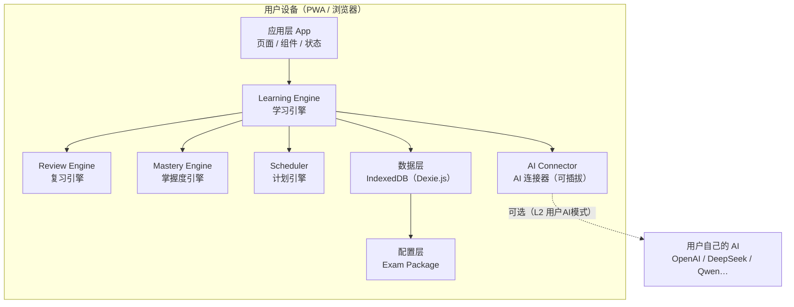
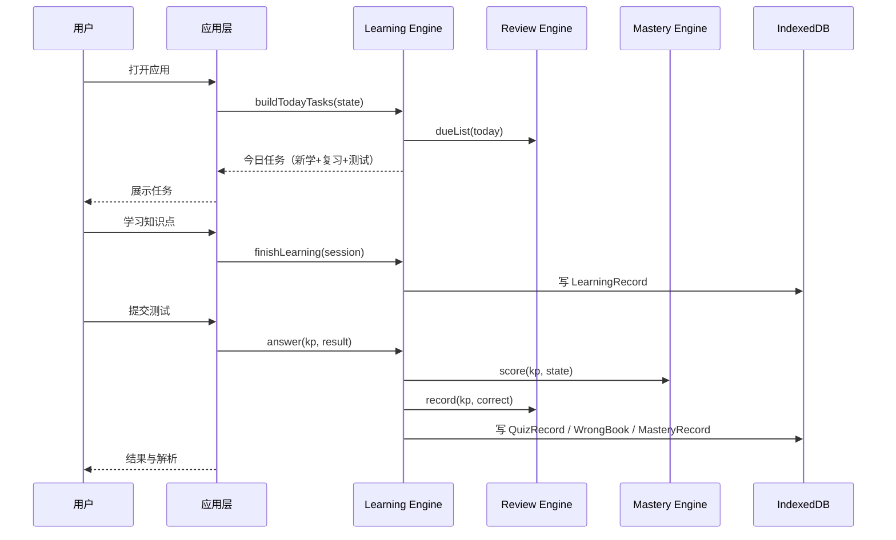

# AI Exam OS · 系统架构设计图

> 依据：《AI Exam OS PRD V1.0》　版本：v1.0　日期：2026-08-08
> 目的：为开发 Agent 提供唯一权威的架构依据，防止实现发散。

## 1. 架构总览（分层）



关键约束：

- 页面/组件**不包含任何学习算法**；算法只存在于 `core/` 引擎模块。
- 所有考试差异（科目、章节、权重、间隔、提示词）**只来自配置包**，禁止硬编码。
- AI 是可选层：L0 无 AI 时产品完整可用。

## 2. 核心引擎设计

### 2.1 Learning Engine（学习引擎）

职责：驱动“学习 → 测试 → 复习 → 掌握”闭环。

```ts
interface LearningEngine {
  buildTodayTasks(state: UserState): Task[];        // 今日任务生成
  startLearning(knowledgeId: string): LearningSession;
  finishLearning(session: LearningSession): void;   // 写 LearningRecord
  answer(knowledgeId: string, result: QuizResult): void; // 写测试/错题，联动复习与掌握
}
```

### 2.2 Review Engine（复习引擎）

职责：间隔排期与自适应。

```ts
interface ReviewEngine {
  nextReview(kp: KnowledgePoint, m: MasteryState): string;   // 返回下次复习日期
  dueList(today: string): string[];                          // 到期清单
  record(knowledgeId: string, correct: boolean): void;       // 更新间隔与复习步
}
```

规则（可配置，默认值见 `learning_strategy.json`）：

- 间隔表 `[1,3,7,15,30]`；基线 = `lastReview || lastStudy || planStart`。
- 答错 → 回到 Day 1 重新进入间隔链；正确率低 → 缩短/原地巩固；高 → 拉长/跳步。
- 复习步达到上限 → 长期掌握，不再排期。

### 2.3 Mastery Engine（掌握度引擎）

```ts
interface MasteryEngine {
  score(kp: KnowledgePoint, state: LearningState): number;   // 0–100
  level(score: number): '陌生' | '初步理解' | '掌握' | '熟练' | '精通';
}
```

公式（权重可配置）：

```
掌握度 = 学习完成度 + 测试正确率 + 复习表现 − 遗忘衰减
```

等级映射：0–30 陌生 / 30–60 初步理解 / 60–80 掌握 / 80–95 熟练 / 95+ 精通。

### 2.4 Scheduler（计划引擎）

- 输入：考试日期、每日学习时间、知识量、当前水平。
- 输出：阶段划分（基础/强化/冲刺）与每日任务配额。
- 每日任务 = 新学（默认 3）+ 复习（默认 8）+ 测试（默认 10）。
- 优先级：`重要度 × 遗忘程度 × 薄弱程度 ÷ 预计耗时`。

## 3. 学习闭环时序



## 4. AI Connector（可插拔 AI 层）

### 4.1 Provider 模式

```ts
interface AIProvider {
  chat(messages: ChatMessage[], options?: ChatOptions): Promise<string>;
  testConnection(): Promise<boolean>;
}
```

适配器：`OpenAIProvider / DeepSeekProvider / QwenProvider / CustomOpenAICompatProvider`。新增模型只加 Adapter，不改引擎。

### 4.2 AI 能力分级

| 等级 | 说明 | 依赖 |
|---|---|---|
| L0 | 无 AI：学习/测试/复习/统计全部本地 | 无 |
| L1 | 平台 AI 模式（未来） | 平台额度 |
| L2 | 用户 AI 模式（V1.5 重点） | 用户自己的 Key |

### 4.3 Prompt Library

- 提示词**不写死在组件**，存放在 `ai_prompt.json`（teacher / summary / mistake-analysis / generate-question / exam-builder）。
- 模板使用 `{knowledge}`、`{level}` 等占位符，由 Prompt 管理器渲染。

### 4.4 安全

- API Key 仅存本地（IndexedDB + AES 加密），**永不发送到任何服务器**。
- AI 请求由浏览器直接发往用户配置的服务商（V1.5），无中转。

## 5. Config Driven：Exam Package

每个考试是一个配置包（不是代码）：

```
exam-package/
├── exam.json              # 考试信息
├── subjects.json          # 科目与权重
├── knowledge.json         # 知识图谱（五级结构 + 学习元素）
├── questions.json         # 题库
├── learning_strategy.json # 学习/复习/掌握/番茄参数
└── ai_prompt.json         # Prompt 库
```

加载流程：读取 → **构建期校验**（标识唯一、引用有效、测评完整、覆盖统计）→ 导入 IndexedDB → 学习引擎运行。

未来：用户上传大纲 → AI 解析 → 生成 Exam Package → 导入即得新考试系统（V2，不在 Phase 1 范围）。

## 6. 数据模型（IndexedDB 表）

| 表 | 关键字段 | 说明 |
|---|---|---|
| UserProfile | id, nickname, exam_id, target_score, exam_date, daily_time, level | 单用户本地 |
| ExamPackage | id, name, version, config(json) | 配置包缓存 |
| KnowledgePoint | id, exam_id, subject, chapter, name, type, importance, difficulty, prerequisite[], related[] | 只读内容 |
| LearningRecord | id, knowledge_id, start_time, finish_time, duration, status | 追加式 |
| MasteryRecord | knowledge_id, score, review_count, last_review, next_review | 每知识点一条 |
| Question | id, knowledge_id, type, content, options, answer, analysis | 只读内容 |
| WrongBook | question_id, knowledge_id, wrong_count, reason, last_wrong | 按题收敛 |
| DailyTask | date, knowledge_id, kind(new/review/quiz), status | 每日派生 |
| QuizRecord | knowledge_id, set_index, answers, correct, duration | 追加式 |
| StudySession | date, duration_sec, source(plan/free) | 番茄/计时 |

## 7. 前端技术栈与目录

技术栈（按 PRD）：React + TypeScript + Tailwind CSS + Dexie.js + PWA（Vite）。

```
src/
├── app/               # 路由与应用壳
├── pages/             # 首页/学习/知识库/测试/错题/复习/数据分析/AI助手/设置
├── components/        # UI 组件
├── core/
│   ├── learning-engine/
│   ├── review-engine/
│   ├── mastery-engine/
│   └── scheduler/
├── knowledge/         # 农学 339 配置（V1）
├── exam-engine/       # Exam Package 加载/校验/导入
├── ai/
│   ├── provider/      # Provider 接口与注册
│   ├── adapters/      # OpenAI/DeepSeek/Qwen…
│   └── prompts/       # Prompt 渲染
├── storage/           # Dexie 封装与迁移
└── config/exam-packages/  # 内置配置包
```

## 8. 质量与测试策略

- 引擎（learning/review/mastery/scheduler）为**纯函数 + 依赖注入**，可单测。
- Exam Package 校验在构建期与导入时双执行。
- P0 链路（建目标 → 看知识体系 → 每日任务 → 学习 → 测试 → 复习 → 掌握 → 报告）有自动化冒烟测试。
- 所有用户可控文本输出转义；导入数据强校验。

## 9. 明确边界（Phase 1 不做）

- 不做：社交、排行榜、积分商城、在线课程视频、社区、平台统一 AI 调用。
- 不做：AI 考试系统生成器（V2）；用户 AI 接入（V1.5）。
- 不做：任何服务器/后端/账号系统。
